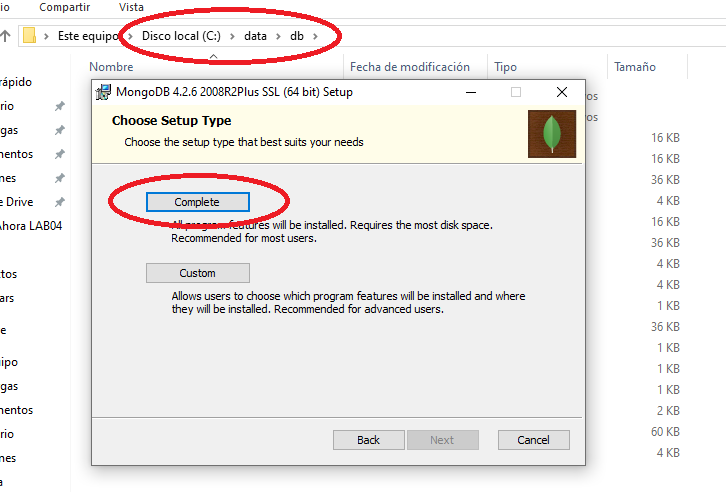
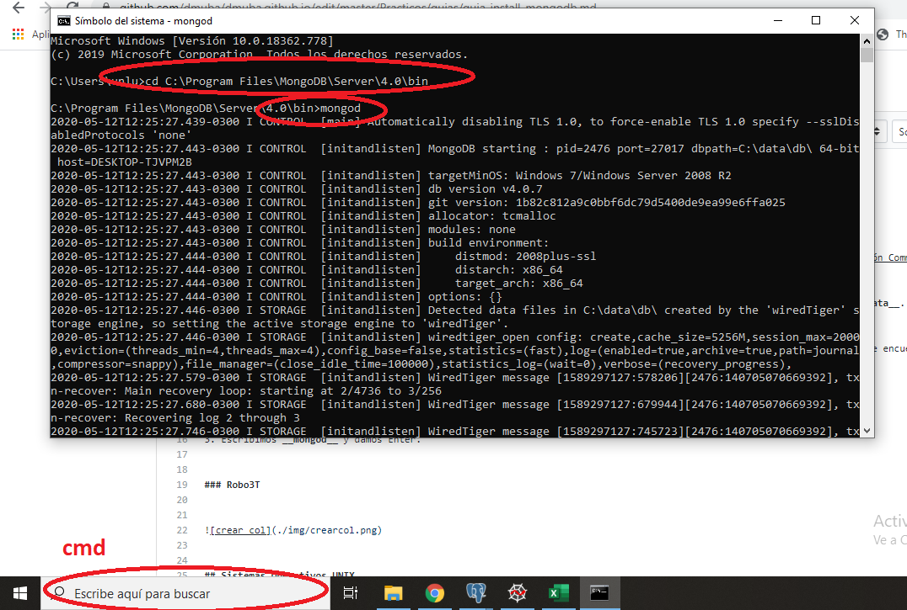
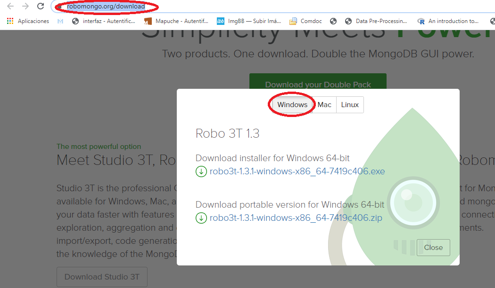
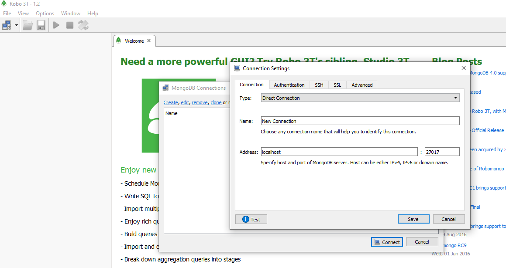

# Guía de Instalación de MongoDB y Robo 3T

En esta guía vamos a mostrar paso a paso como instalar MongoDB y Robo3T. Además, hacia el final de la guía, vamos a mostrar como restaurar y backupear Base de Datos Mongo a través de los comandos __mongorestore__ y __mongodump__.

## Sistemas Operativos Windows

### Servidor MongoDB

Los pasos para instalar el servidor de MongoDB se describen a continuación:
1. En primer lugar, vamos a instalar el Servidor MongoBD, para ello debemos descargarlo desde [el Sitio Web, en la Sección Community](https://www.mongodb.com/download-center/community) y descargamos el Server -archivo MSI- (en la Sección Server) para nuestro Sistema Operativo Windows. 
2. Una vez que descargado el instalador, se instala optando por el tipo de instalación __complete__.
3. Ahora, debemos crear una carpeta llamada __data__ en la Unidad __C:__ y dentro de ella una carpeta que denominada __db__. El path completo de estos nuevos directorios quedará de la siguiente manera: __C:\data\db__.

A continuación podemos observar gráficamente estas últimas instrucciones:



Ahora ya tenemos instalado el servidor mongoDB, cada vez que vayamos a trabajar con el debemos iniciarlo ejecutando el archivo __mongod__ que se encuentra en el directorio de instalación, generalmente en __C:\Program Files\MongoDB\Server\<VERSION_INSTALADA>\bin__. 
En caso que no sepas como hacerlo, seguí las siguientes instrucciones:
1. Abrimos una Consola de Windows escribiendo _cmd_ en la barra de búsqueda de la barra inferior de Windows.
2. Escribimos __cd C:\Program Files\MongoDB\Server\<VERSION_INSTALADA>\bin__.
3. Escribimos __mongod__ y damos Enter.
4. Cumplidos estos pasos, se iniciará el Servidor Mongo, el cual estará escuchando conexiones en el puerto 27017 (por defecto).

A continuación podemos observar gráficamente estas últimas instrucciones:




### Robo3T
Si bien podríamos con MongoDB desde consola, ejecutando el archivo __mongo__, existen dos interfaces gráficas que harán mucho mas sencillas nuestras interacciones: Robo 3T y Meet Studio 3T (su hermano mayor según se anuncia en el sitio web oficial).

Nosotros vamos a trabajar con Robo 3T que es la opción mas sencilla y liviana para interactuar con nuestras Bases de Datos NOSQL. 

Los pasos para instalar el servidor de MongoDB se describen a continuación:
1. Descargamos ROBO 3T del [Sitio web de la herramienta](https://robomongo.org/download), de acuerdo a la versión de nuestro Sistema Operativo.
2. Ejecutamos el instalador, que es un instalador típico de Windows (siguiente, siguiente...) y listo.




## Ubuntu

### Robo3T

1. Para instalar Robo3T en Ubuntu primero hay que descargarlo desde el sitio oficial https://robomongo.org/download. Hacer click en "*Download Robo 3T*" (No hacer las descarga desde "Download Your Double Pack"). Se selecciona la solapa *"Linux"*, y descargar el archivo *.tar.gz* en la carpeta *Descargas*.

2. Abrir la *Terminal*, ingresar a la carpeta *Descargas*, y descomprimir el archivo descargado con el comando *tar*.

```
cd ~/Descargas
tar -xzf robo3t-x.x.x-linux-x86_64-xxxxxxx.tar.gz
```

3. Renombar la carpeta generada por el nombre *robo3t*:

```
mv  robo3t-x.x.x-linux-x86_64-xxxxxxx robo3t
```

4. Mover la carpeta robo3t de *~/Descargas/robo3t* a */opt/robo3t*:
```
sudo mv robo3t /opt/robo3t
```

5. Generar link simbólico del ejecutable robo3t para que quede accesible para usar como comando:
```
sudo ln -s /opt/robo3t/bin/robo3t /usr/bin/robo3t
```

6. Crear el acceso directo para acceder desde el menú de aplicaciones del escritorio. Para eso hay que crear un archivo en la carpeta *~/.local/share/applications*

```
gedit ~/.local/share/applications/robo3t.desktop
```

Editar el archivo con las siguiente configuración y guardar

```
[Desktop Entry]
Encoding=UTF-8
Type=Application
Name=Robo3t
Icon=/opt/robo3t/bin/icon.png
Exec="/opt/robo3t/bin/robo3t"
Comment=Robo3t
Categories=Development;
Terminal=false
StartupNotify=true
```

## Utilizando MongoDB a través de Robo 3T (para todos los Sistemas Operativos)

Una vez que tenemos el Servidor de MongoDB y Robo 3T instalados y operativos, podemos utilizar MongoDB a través de la interfaz gráfica de Robo 3T. Para ello debemos seguir los siguientes pasos, que son muy sencillos:
1. Iniciamos Robo 3T a partir del Menú de Programas.
2. Cuando iniciamos Robo 3T, la aplicación nos consultará sobre cual es el Servidor de MongoDB al que nos vamos a conectar, para lo cual creamos una nueva conexión.
3. Para crear la conexión, vamos a la opción __create__ y definimos el host donde está el Servidor, en nuestro caso __localhost__ y el puerto, que por defecto es __27017__. A su vez, definimos __Direct Connection__ en como tipo de conexión (campo Type) y podemos definir un nombre para la conexión -entre algunas otras opciones- que por defecto será __New Connection__.
4. Una vez que seteamos todos estos campos presionamos en __Save__.
5. A continuación, seleccionamos nuestra conexión, presionamos __Connect__ y listo, ya estamos conectados al Servidor mediante Robo 3T para empezar a trabajar.

A continuación podemos observar gráficamente como conectarnos a MongoDB con Robo 3T:



Para empezar a trabajar, creamos otra Guía de Laboratorio, la número III, que muestra una introducción a como gestionar nuestras bases de datos con estas herramientas. Podemos acceder presionando [aquí](https://github.com/dmuba/dmuba.github.io/blob/master/Practicos/guias/guia-labo03.md).


## Backups y Restauración de una base de datos (mongodump y mongorestore)

### Exportar una Base de Datos desde un arhivo gzip

Para exportar una base de datos cuyo nombre es _nombre_base_datos_ podemos utilizar __mongodump__ de la siguiente manera:

```bash
mongodump  -h localhost -d nombre_base_datos -o path_backup --gzip
```

El último argumento "--gzip" es para que comprima las colecciones en un archivo gzipeado, de lo contrario realiza los backups en archivos json, uno por cada colección.


### Restaurar una Base de Datos desde un arhivo gzip

Para restaurar una Base de Datos que fue backupeada o "dumpeada" a partir de un mongodump como el anterior, utilizamos el siguiente comando:

```bash
mongorestore -d nombre_nueva_base_datos -o path_donde_esta_backup --gzip
```
### Restaurar una Base de Datos desde un arhivo json

Para restaurar una Base de Datos a partir de un archivo __json__ podemos utilizar el siguiente comando:

```bash
mongoimport --db nombre_nueva_base_datos --collection nombre_coleccion --file path_donde_esta_json --jsonArray --legacy
```

Recuerden que si están utilizando el Sistema Operativo Windows, previo a ejecutar estos comandos debemos posicionarnos en el directorio de instalación de MongoDB, generalmente en __C:\Program Files\MongoDB\Server\<VERSION_INSTALADA>\bin__.
